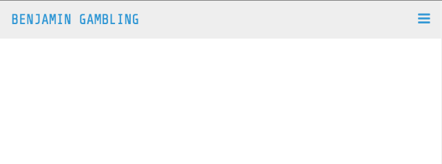
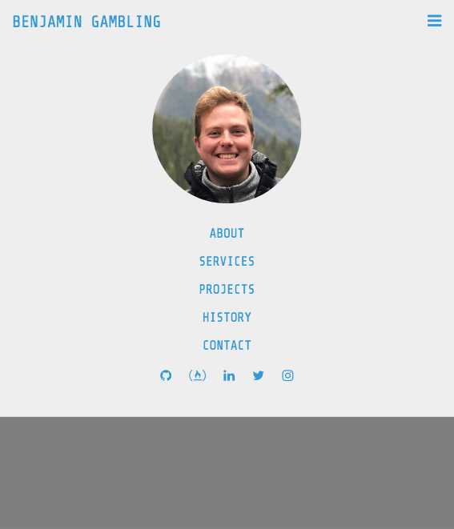
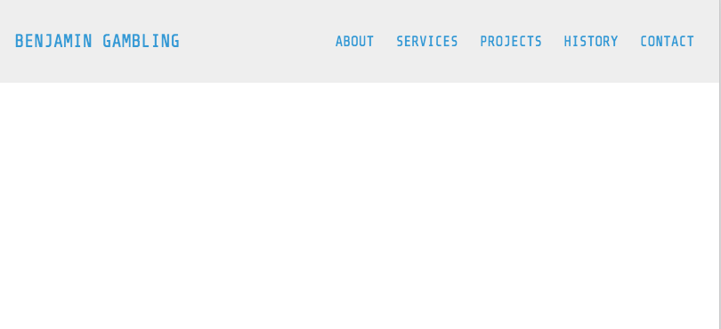

# Responsive Portfolio Navbar

> **Navbar < 875px Width**

# 

> **Navbar < 875px Width Open**

# 

> **Navbar > 875px Width**

# 

## Table of contents

1. [Demo](#demo)
2. [Technologies](#technologies)
3. [Features](#features)
4. [Development](#development)
5. [License](#license)
6. [Installation](#installation)

## Demo

Here is the working live demo:
[https://benjamin-gambling.github.io/responsive-portfolio-navbar/](https://benjamin-gambling.github.io/responsive-portfolio-navbar/).

## Technologies

- Javascript modules, ES6, Font Awesome Icons
- [Webpack](https://webpack.js.org/)
- [NPM](https://www.npmjs.com/)

  
  

## Features

- Mobile Responsive Design
- Fully Customisable to Users Prefrences
- Background Cover to Focus on Menu
- Install via NPM (See Instalation Guide)

### Devlopment

- Add Aminations to Toggle
- Improve the desktop nersion of Navbar

## License

> You can check out the full license [here](LICENSE)

This project is licensed under the terms of the **MIT** license.

## Installation

1. In you project directory copy and paste:-
   `npm i @benjamin-gambling/mobile-responsive-portfolio-menu --save`

2. Then in you Javascript file use: -
   `import { navbar } from "@benjamin-gambling/mobile-responsive-portfolio-menu"`

3. Add the HTML and CSS editing as you wish.

HTML: -

  <nav class="navbar">
      

        <a class="nav-name" href="#">BENJAMIN GAMBLING</a>
        

          <i class="fa fa-bars"></i>
        

      

      

        <ul class="nav-nav">
          <li class="nav-item hidden">
            
          </li>
          <li class="nav-item"><a href="#">ABOUT</a></li>
          <li class="nav-item"><a href="#">SERVICES</a></li>
          <li class="nav-item"><a href="#">PROJECTS</a></li>
          <li class="nav-item"><a href="#">HISTORY</a></li>
          <li class="nav-item"><a href="#">CONTACT</a></li>
          <li class="nav-item hidden">
            <a href="#"><i class="fa fa-github"></i></a>
            <a href="#"><i class="fa fa-free-code-camp"></i></a>
            <a href="#"><i class="fa fa-linkedin"></i></a>
            <a href="#"><i class="fa fa-twitter"></i></a>
            <a href="#"><i class="fa fa-instagram"></i></a>
          </li>
        </ul>
      

    </nav>
    

    CSS: -
      :root {
      --main: rgb(52, 152, 219);
      --main-gray: rgb(238, 238, 238);
      }

      _,
      _:before,
      \*:after {
      box-sizing: border-box;
      }

      body {
      margin: 0px;
      font-family: "Share Tech Mono", monospace;
      color: var(--main);
      }

      a,
      a:link,
      a:visited {
      color: var(--main);
      background-color: transparent;
      text-decoration: none;
      }

      ul {
      list-style-type: none;
      padding-inline-start: 0px !important;
      display: flex;
      flex-direction: row;
      }

      .hidden,
      .collapse {
      display: none;
      visibility: hidden;
      }

      .show {
      display: flex;
      visibility: visible;
      }

      .navbar {
      display: flex;
      flex-direction: row;
      width: 100%;
      background-color: var(--main-gray);
      padding: 20px;
      align-items: center;
      }

      .nav-name {
      font-size: 25px;
      }

      .nav-toggle {
      font-size: 25px;
      color: var(--main);
      margin-left: auto;
      display: none;
      visibility: hidden;
      cursor: pointer;
      }

      .nav-top {
      display: flex;
      justify-content: start;
      }

      .nav-collapse {
      flex-direction: row;
      margin-left: auto;
      }

      .nav-img {
      height: 15rem;
      width: auto;
      border-radius: 50%;
      padding: 5px;
      }

      .nav-item {
      font-size: 20px;
      padding: 10px;
      justify-content: space-evenly;
      }

      .nav-item > a {
      padding: 5px;
      }

      .menu-open-background {
      height: 100vh;
      width: 100vw;
      background-color: rgba(0, 0, 0, 0.5);
      }

      @media screen and (max-width: 875px) {
      .navbar {
      position: fixed;
      flex-direction: column;
      align-items: flex-start;
      }

      .nav-top {
      width: 100%;
      }

      .nav-toggle {
      display: flex;
      visibility: visible;
      }

      .nav-collapse {
      flex-direction: column;
      justify-content: center;
      text-align: center;
      margin: auto auto;
      transition: all 650ms ease-in-out;
      }

      ul {
      flex-direction: column;
      }
      }
